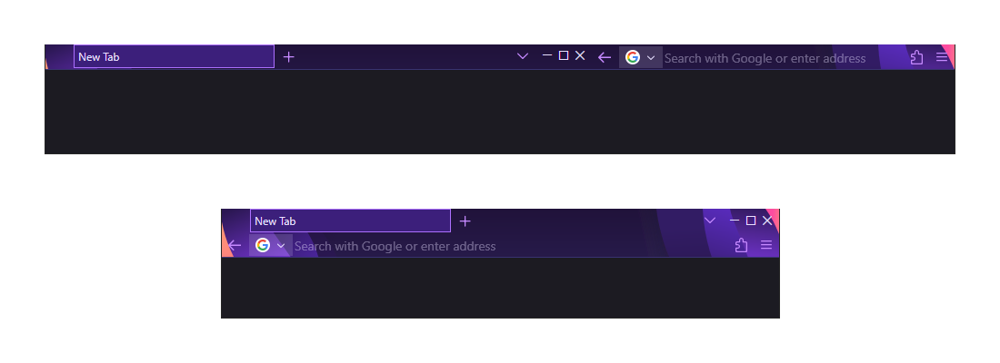

# Foxlim

Foxlim is a slim, compact, and simple oneline stylesheet for the Proton UI Refresh in Firefox Desktop.

Inspired by [Waterfall](https://github.com/crambaud/waterfall).

## Features

- oneline
- layout-only stylesheet (which means that it doesn't break themes)
- simple - most elements are hidden
- sharp - no border radii
- compact - as little padding as possible
- tabs on the left, URL bar on the right.

Tested with Firefox versions 139 to 151.

## Installation

1. Go to **`about:config`** in the URL bar. Search for **`toolkit.legacyUserProfileCustomizations.stylesheets`** and double-click it or press *Toggle* to set it to **`true`**.

2. Go to **`about:profiles`** in the URL bar and open the root directory of your current profile.

3. Make a new directory called `chrome`.

4. Download this [**`userChrome.css`**](https://github.com/shoplukche/foxlim/blob/main/userChrome.css) into that `chrome` directory.

5. Restart Firefox.

> [!TIP]
> 
> You can right-click on the chrome, click on *Customize Toolbar…*, and remove what you don't need.

> [!TIP]
> 
> Some chrome-related things can be modified through a `user.js` file.
> 
## Other

Other properly-made stylesheets:
- [gwfox](https://github.com/akkva/gwfox)
- [FoxOne](https://github.com/Firnschnee/FoxOne)
- [LittleFox](https://github.com/biglavis/LittleFox)
- [Malevich](https://github.com/hermitm0nk/malevich)

> [!CAUTION]
> 
> Proton UI Refresh is still broken and custom stylesheets can only fix some of the superficial problems.
> 
> https://discourse.mozilla.org/t/so-now-we-can-not-even-turn-off-proton/83108/

> [!TIP]
> 
> If you can do without Firefox, use Basilisk, Pale Moon, or a fork of them.

This stylesheet is a little broken (eg. alert() is too small), because Mozilla employees, as all bike-shedders, love to break everything.

The reason Mozilla doesn't officially support custom browser CSS stylesheets is because they don't know how to use CSS properly. Just open the Browser Toolbox to see the nonsense CSS they wrote for the browser. It's worse than AI-generated.

Mozilla needs to simplify their browser's CSS and give userChrome.css and userContent.css highest priority, instead of having to put thousands of "!important" rules in them.

Mozilla isn't the only one, and these problems are symptoms of a much bigger problem, which I'm working on solving forever.
